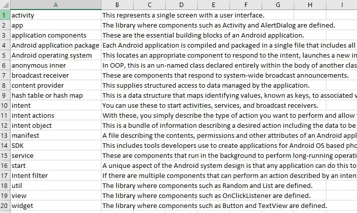
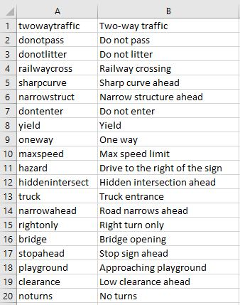

# Quiz App

This is an Android quiz application I made for our Mobile Application Development course at NSCC (Nova Scotia Community College). I initially meant to create a Nova Scotia Road Signs quiz in which users should guess what the road sign means as shown in the pictures. 

  

I added a dropdown (spinner) to it later on to use it as a reviewer for one of our (actual) quizzes in class.

 

The CSV files which stores the quiz data are stored in app/src/main/res/raw/
* quiz3.csv
* whatisthissign.csv

The terms and definitions quiz source file looks like this:

The first column contains the terms, while the second column contains the definitions

The picture quiz (NS Road Signs quiz) source file looks like this:

The first column contains the filename of the PNG files (without the extension) in the /app/src/main/res/drawable/ folder, while the second column is its meaning.
